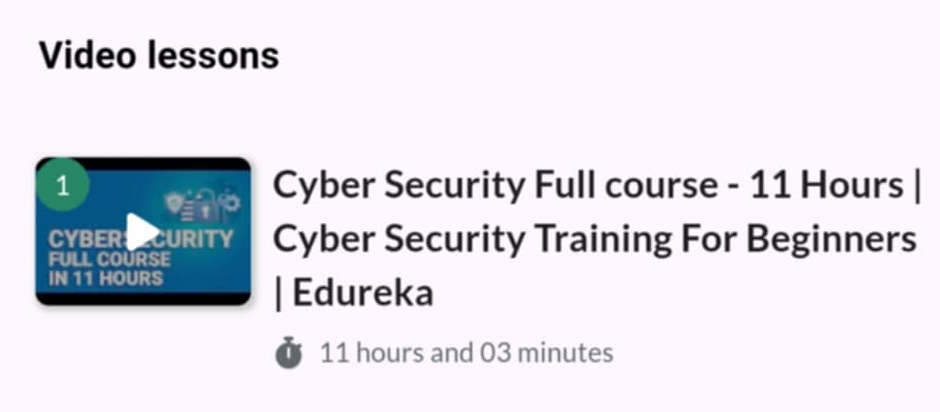
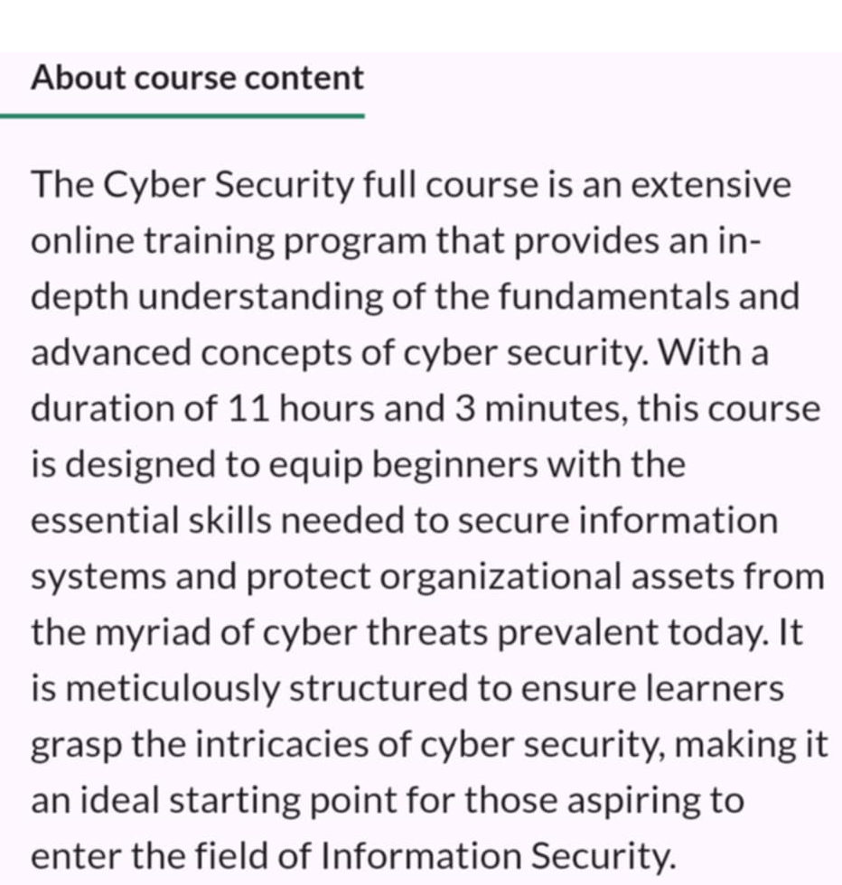
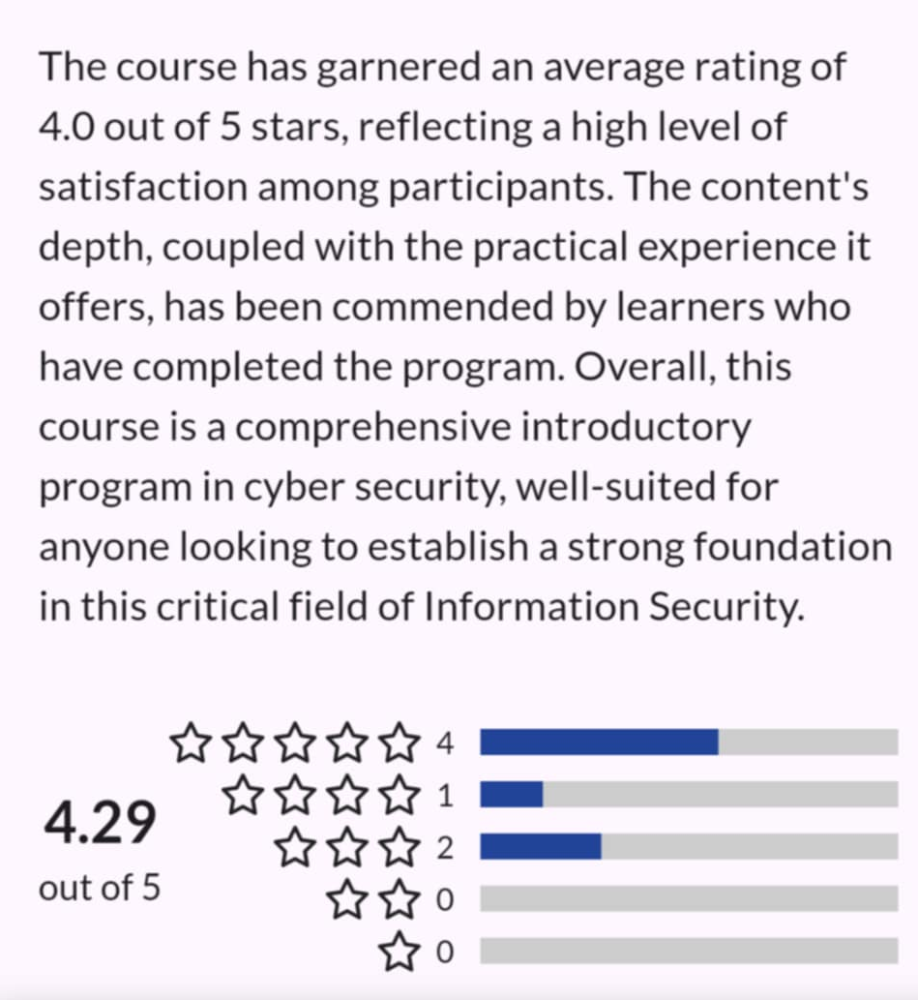

# 🛡️ Cybersecurity Full Course – YouTube (Erika) + InfoSecTrain

This repository documents my learning journey from the **Cybersecurity Fundamentals** courses provided by [Erika (YouTube)] and InfoSecTrain. It includes structured notes, practice demos, code-based challenges, screenshots, and completion certificate.

---

## 📚 Notes

All notes are written in Markdown and organized by topic:

- [`intro-to-cybersecurity.md`](./notes/intro-to-cybersecurity.md)
- [`authentication-models.md`](./notes/authentication-models.md)
- [`network-concepts.md`](./notes/network-concepts.md)
- [`risk-management-basics.md`](./notes/risk-management-basics.md)
- [`cyber-threats-overview.md`](./notes/cyber-threats-overview.md)

---

## 🛠️ Demo Labs

- [`firewall-hardening-lab.md`](./demo/firewall-hardening-lab.md)
- [`access-control-exercise.md`](./demo/access-control-exercise.md)
- [`vulnerability-scan-setup.md`](./demo/vulnerability-scan-setup.md)

---

## 🧠 Information Resources

- [`security-domains-overview.md`](./information/security-domains-overview.md)
- [`common-attacks-and-mitigations.md`](./information/common-attacks-and-mitigations.md)

---

## 🖼️ Course Screenshots

| Description              | Screenshot |
|--------------------------|------------|
| 📘 Course Overview        |  |
| 🎯 Course About Section   |  |
| ✅ Final Review Section   |  |

---

## 📜 Certificate

- 🎓 [`certificate-cybersecurity-fullcourse.pdf`](./cert/cybersecurity-masterclass-infosectrain.jpg
)

---

## 📝 Course Review

This course blends structured fundamentals from InfoSecTrain and beginner-friendly walkthroughs from Erika on YouTube. It provides a holistic foundation for anyone entering the field of cybersecurity.

### ✅ What I Liked

- Beginner-friendly language and structure  
- Practical demonstrations and visual guides  
- Well-structured modules that build progressively

### 📌 What Could Be Improved

- Needs more interactive challenges or CTF-based labs  
- Some topics could benefit from in-depth case studies

---

## 🎯 Ideal For

- Beginners in cybersecurity and ethical hacking  
- IT students transitioning into InfoSec  
- Learners preparing for foundational certifications (e.g., CompTIA Security+)

---

## ✍️ Author

**Thành Danh** – Pentester & Cybersecurity Research  

GitHub: [@ngvtdanhh](https://github.com/ngvtdanhh)  
Email: ngvu.thdanh@gmail.com

---

## 📄 License

This project is licensed under the **GNU AGPL v3.0**.  
See [`LICENSE`](./LICENSE) for full terms.

© 2025 ngvtdanhh. All rights reserved.
